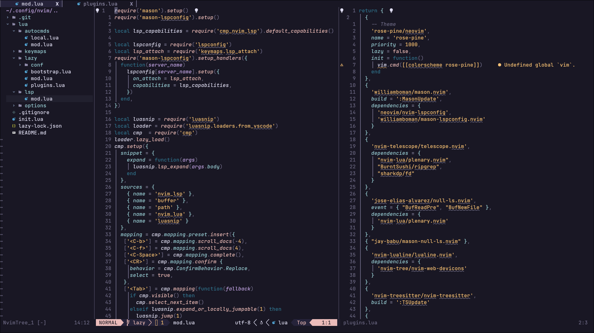

<div align="center">
    <h1>Neovim for Colemak</h1>
    <span>with <a href="https://github.com/folke/lazy.nvim">lazy.nvim</a></span>
</div>



# Keymap for Colemak

|Qwerty|Colemak|
|--|--|
|h (left)|h|
|j (down)|n|
|k (up)|e|
|l (right)|i|
|i (insert)|l|
|e (end of the word)|j|
|n (next search result)|k|
|N (previous search result)|K|

# Usage

```bash
# Linux
git clone --depth 1 --branch lazy https://github.com/zaiic/nvim.git ~/.config/nvim

# Windows
git clone --depth 1 --branch lazy https://github.com/zaiic/nvim.git ~/AppDate/Local/nvim

# Then, enjoy it.
```

# Features

- LSP
- LSP installer: [mason.nvim](https://github.com/williamboman/mason.nvim)
- Color Scheme: [rose-pine](https://github.com/rose-pine/neovim)
- File finder: [telescope.nvim](https://github.com/nvim-telescope/telescope.nvim)
- Formatters: [null-ls.nvim](https://github.com/jose-elias-alvarez/null-ls.nvim)
- Markdown Preview: [markdown-preview.nvim](https://github.com/iamcco/markdown-preview.nvim)
- DAP: [nvim-dap](https://github.com/mfussenegger/nvim-dap)
- DAP UI: [nvim-dap-ui](https://github.com/rcarriga/nvim-dap-ui)
- DAP Virtual Text: [nvim-dap-virtual-text](https://github.com/theHamsta/nvim-dap-virtual-text)
