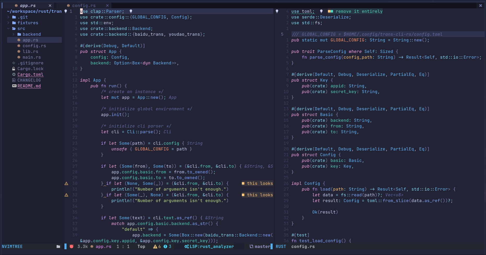

# NeoVim for Colemak



## Introduction
The repository is about configuration of **NeoVim (v0.8.0+)** for **Colemak** user. And here is common keymaps:

|Qwerty|Colemak|
|--|--|
|h (left)|h|
|j (down)|n|
|k (up)|e|
|l (right)|i|
|i (insert)|l|
|e (end of the word)|j|
|n (next search result)|k|
|N (previous search result)|K|

## Plugin Manager

[packer.nvim](https://github.com/wbthomason/packer.nvim): A use-package inspired plugin manager for NeoVim. Uses native packages, supports Luarocks dependencies, written in Lua, allows for expressive config.

## Features

- LSP
- LSP Installer ([Mason](https://github.com/williamboman/mason.nvim))
- Dashboard ([alpha](https://github.com/))
- File Search ([telescope.nvim](https://github.com/nvim-telescope/telescope.nvim))
- [Easy Comment](https://github.com/numToStr/Comment.nvim)
- Directory Tree ([nvim-tree.nvim](https://github.com/kyazdani42/nvim-tree.lua))
- [Dev Icons](https://github.com/kyazdani42/nvim-web-devicons)
- Theme ([tokyonight.nvim](https://github.com/folke/tokyonight.nvim))
- **[Rust Tools](https://github.com/simrat39/rust-tools.nvim) (if you don't need it, plz delete it manually.)**
- [Markdown Preview](https://github.com/iamcco/markdown-preview.nvim)
- Debugger Adapt Protocol (not configured yet...)

## Usage

```bash
# Clone the repository.
git clone --depth 1 https://github.com/zaiic/nvim.git

# Install the plugin manager (packer.nvim) for Unix/Linux.
git clone --depth 1 https://github.com/wbthomason/packer.nvim\
 ~/.local/share/nvim/site/pack/packer/start/packer.nvim

# Install the plugin manager (packer.nvim) for Windows.
git clone https://github.com/wbthomason/packer.nvim "$env:LOCALAPPDATA\nvim-data\site\pack\packer\start\packer.nvim"
```

Then enter NeoVim and execute the following commands:
```bash
:PackerSync
:PackerCompile
```
